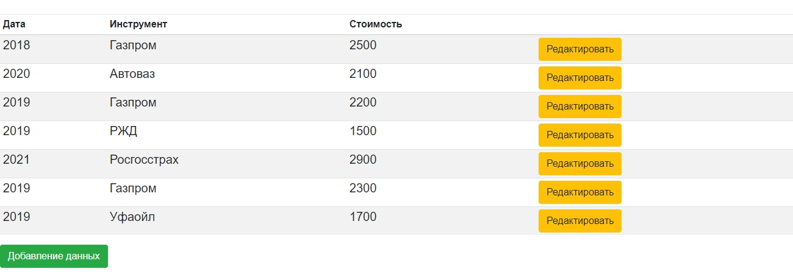
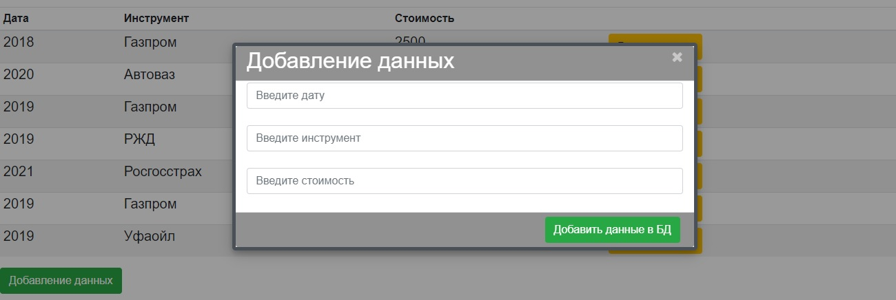
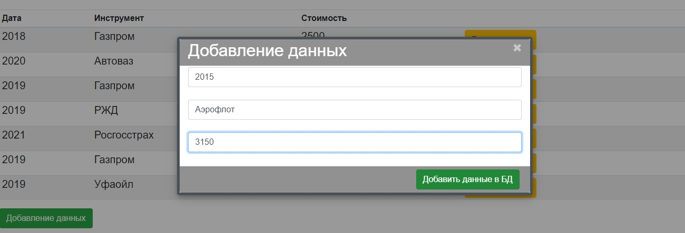
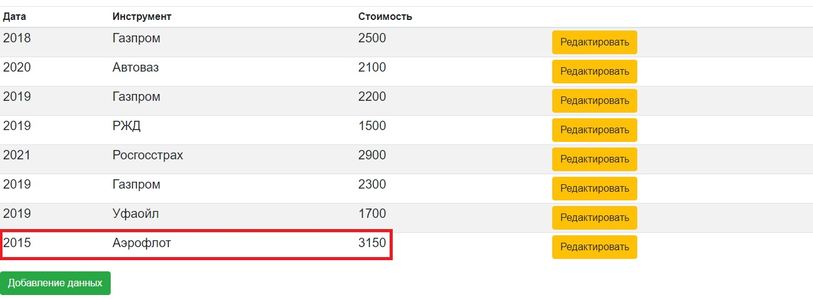
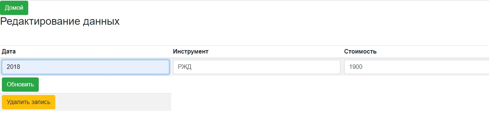
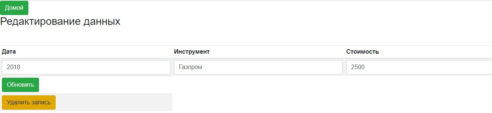
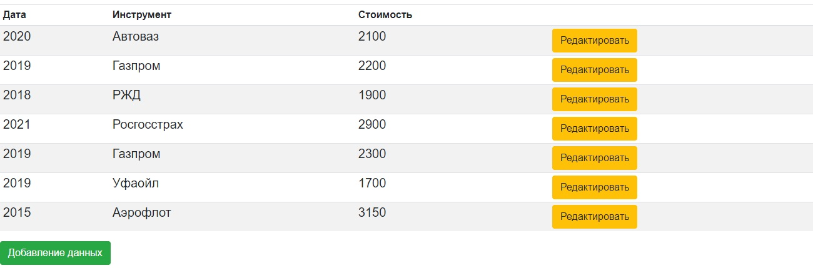

### Задание

Необходимо разработать приложение состоящее из фронтальной и серверной составляющей.
Во фронтальном приложении необходимо на странице реализовать таблицу с возможностью:
- добавления в нее данных (через модальное окно);
- редактирование данных в таблице;
- удаление данных;
В таблице должны располагаться объекты со следующими полями: дата, инструмент (ценная бумага), стоимость.

Пример данных:
> 01.01.2019    Газпром    2000
> 
> 01.01.2019    Автоваз    2500
> 
> 05.01.2019    Сбербанк    10000
> 
> 10.01.2019    Газпром    2500
> 
> 07.10.2019    Автоваз    2100
> 

### 1. Главная страница

### 2. При нажатии на кнопку "Добавление данных" открывается модальное окно в котором можно добавить новые данные

### 3. При нажатии на кнопку редактировать окрывается страница с данными выбранной записи

### 4. На странице редактирования можно обновить и удалить выбранную запись

### 5. На главной странци уже обновлены данные в строке с Инструментом "РЖД" и удалены данные строки с инструментом "Газпром"

